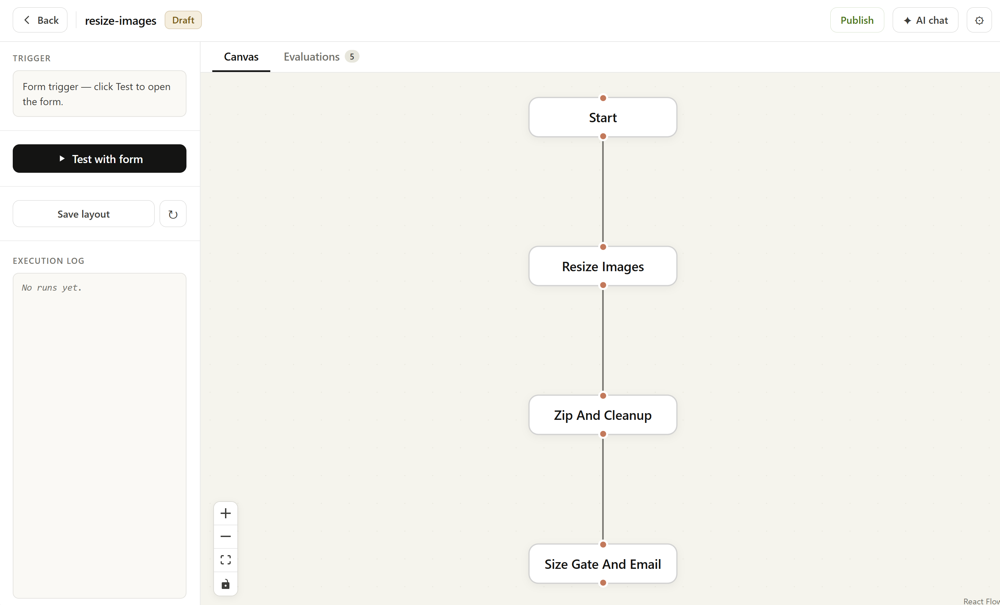
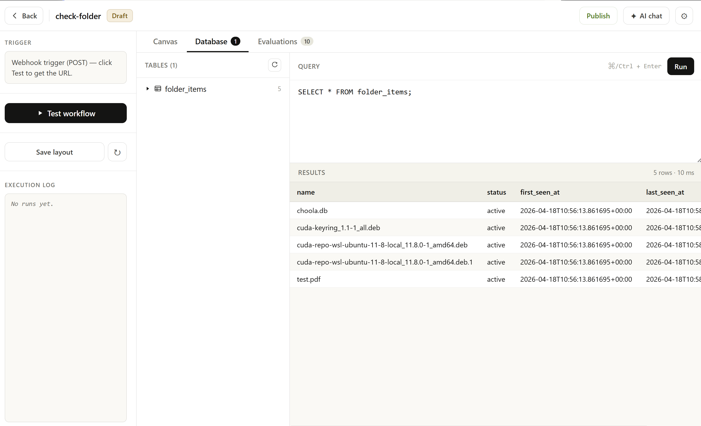
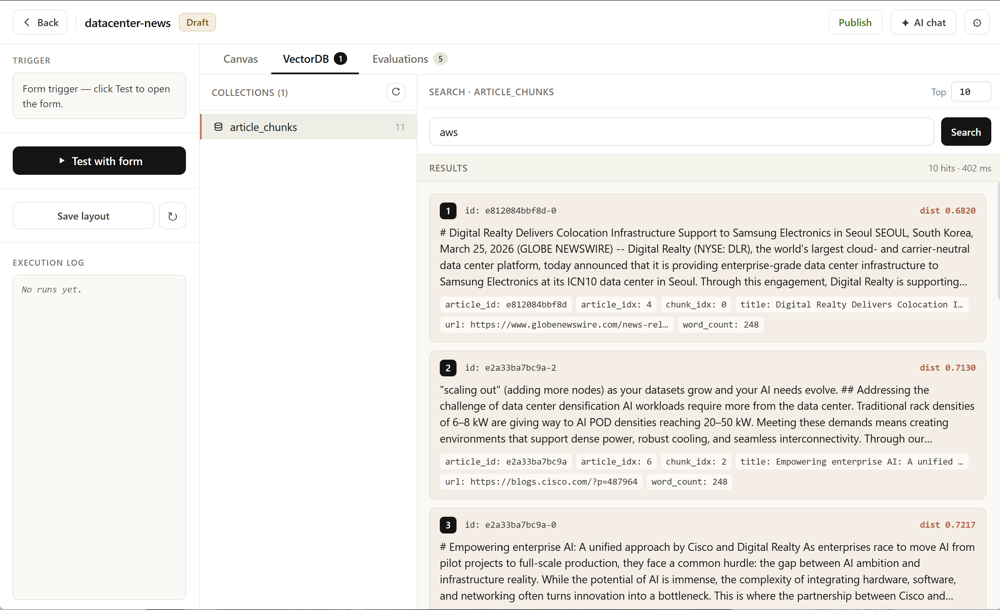
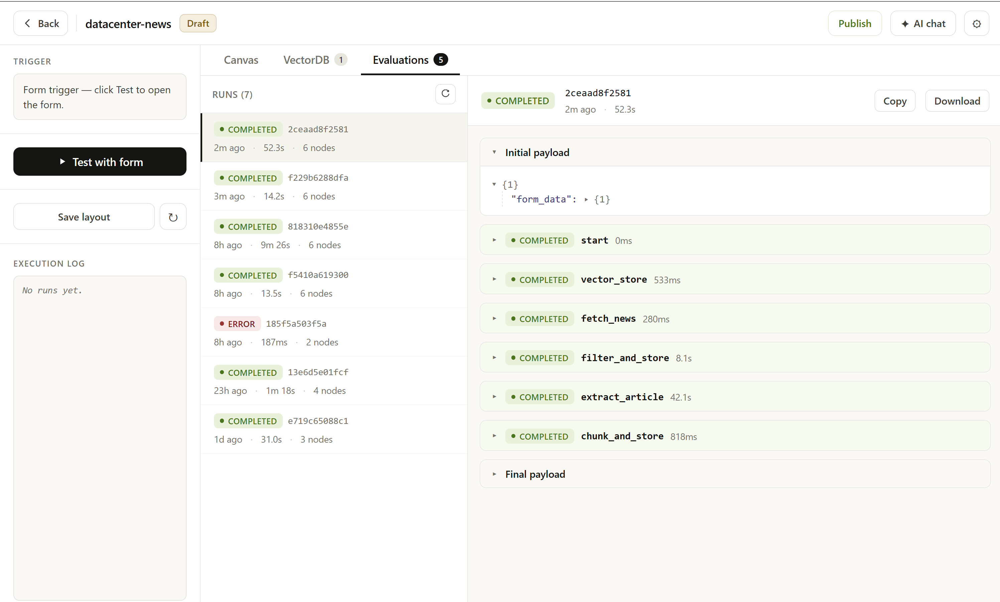
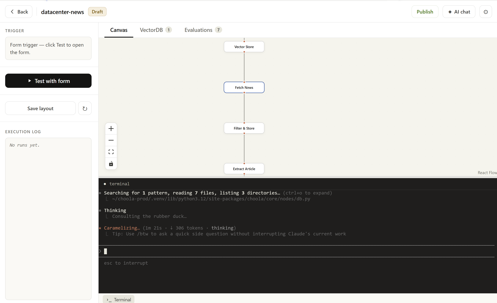

# Choola

**An automation programming framework for AI agents.**

Choola is a Python-first framework for building automations *with* coding agents like Claude Code — not around them. You describe the automation in plain language, a coding agent scaffolds it into a graph of self-contained Python nodes, and the engine runs it with full traceability, cost discipline, and a deterministic execution model that agents can inspect and improve over time.

The framework is deliberately small. A workflow is a folder of Python files. A node is one file. Nodes talk to each other via JSON payloads. That's it — and that's precisely what makes Choola a comfortable surface for agents to generate and evolve code against.

---

> **⚠️ Early-Stage Project — Not for Production**
>
> Choola is under active development. Core node classes, the payload contract, and internal APIs **may change drastically between versions** without backward compatibility. We do not recommend using Choola in production systems at this time. It is intended as an exploration platform and learning tool.

---

## Why Choola

Coding agents are very good at writing small, self-contained functions with clear inputs and outputs. They are much worse at editing sprawling, implicit, cross-file orchestration. Choola turns automation into the first shape and avoids the second. The features below are roughly ordered by how much they matter to an agent that's trying to *build, run, debug, and improve* an automation:

1. **Agent-generated by design** — ships with [Claude Code](https://claude.ai/code) slash commands (`/workflow`, `/node`, `/debug`, `/replay`) that turn English descriptions into working workflows, surface the failing node from an evaluation, or re-run a single step against its saved input. The framework's grep-friendly docstrings, single-file nodes, and explicit payload contracts are tuned for the way agents read and write code.
2. **Workflows are MCP tools** — the engine exposes a JSON-RPC 2.0 endpoint at `/mcp` that publishes every workflow as a callable tool, with optional bearer-token auth via the `mcp_token` global. An external Claude (or any MCP client) can discover, describe, and invoke your automations without scraping the UI or shelling out.
3. **Simple node isolation** — every node is one `.py` file. No cross-node imports. No shared mutable state. The *only* way data moves between nodes is a JSON payload through `execute(payload, context)`. An agent can understand, edit, or replace any single node without reading the rest of the workflow.
4. **Full execution traces, every run** — each run produces an evaluation JSON with per-node input, output, timing, token usage, and full traceback on error. This is the primary debugging surface — agents diagnose and fix workflows from these files the same way a developer would.
5. **Deterministic flow, AI inside** — the DAG is fixed, topologically sorted, and inspectable. The creativity goes *inside* nodes (LLM calls, extraction, classification) where it belongs, not into the orchestration. Agents reason about behavior one node at a time.
6. **Cost guardrails built into the contract** — nodes declare a `@cost` tag (`free`, `paid-one-shot`, `paid-per-item`, `paid-per-call`). Paid loop nodes are required to expose `max_items` caps and `max_consecutive_errors` circuit breakers. An engine-level token circuit breaker enforces `max_tokens_per_run` and `max_tokens_per_hour` globals — a breach raises `TokenLimitExceeded` and aborts the run.
7. **Replay, don't re-run** — `choola replay` re-executes a single node against its previously saved input. You never pay for the whole pipeline twice while debugging a downstream fix, and agents iterating on a node can verify a change without re-issuing expensive upstream LLM calls.
8. **Self-training classifier nodes (`LLML` + `choola dream`)** — the `LLML` node memoizes LLM calls and falls through `cache → local XGBoost → real LLM`, so workflows get cheaper the more they run. `choola dream` walks every workflow, finds every `LLML` node, and trains a per-node XGBoost model from its history. Classification and filter loops that started on Claude can graduate to free local inference without code changes.
9. **Branching, merging, and conditional routing** — fan a payload out to parallel branches, merge them back with per-parent access via `context["parent_outputs"]`, or let any node decide at runtime which branches to activate by returning `{"__active_branches__": [...]}`. Diamond patterns work correctly — a merge node is only skipped if *all* its parents are skipped.
10. **Per-workflow SQLite, vector DB, globals, and encrypted credentials** — state when you want it, none of it hidden. Each workflow gets its own isolated SQLite at `files/db.sqlite` and its own ChromaDB at `files/chroma/`. Credentials live encrypted in the engine's store and are fetched via `await self.get_credential(name)`.
11. **Visual editor + CLI, same source of truth** — the editor renders the same Python files the CLI runs. You can build in the browser, edit in your editor, run `choola dream` from the terminal, and the three never drift. A built-in terminal pane in the editor runs Claude Code scoped to the active workflow so you can iterate without leaving the canvas.

---

## For End Users

### Install

```bash
pip install choola
```

### Initialize a project

In any empty directory:

```bash
choola init          # Creates workflows/, choola.db, and .claude/ (slash commands + permissions)
choola start         # Opens the visual editor at http://localhost:5000
```

`choola init` also drops a Claude Code template into `.claude/` with pre-approved permissions and the `/workflow`, `/node`, `/debug`, and `/replay` slash commands. If `.claude/` already exists, the copy is skipped so your customizations are preserved.

The editor lays each workflow out as a canvas of connected nodes you can drag, wire, and run:



Each workflow also gets its own isolated SQLite database, vector store, and run evaluations — all inspectable from the editor:

| | |
|---|---|
|  |  |
| **Database** — schema + query browser for the workflow's own SQLite | **VectorDB** — ChromaDB collections, schema, and similarity search |
|  |  |
| **Evaluations** — every run's per-node input, output, timing, and tokens | **Claude Code** — built-in terminal for agent-driven node editing, scoped to the active workflow |

### Build a workflow with Claude Code

If you use Claude Code, this is the shortest path from idea to running automation:

```
/workflow build a workflow that takes an uploaded PDF, summarizes it with Claude,
and emails me the summary
```

Claude reads the framework's rules, scaffolds the folder, writes one node per step (form trigger → PDF extractor → LLM → Gmail), wires the DAG, and leaves you with a workflow you can run. The other slash commands handle smaller increments:

| Command | What it does |
|---|---|
| `/workflow <description>` | Scaffold a full workflow from an English description |
| `/node <description>` | Add or edit a single node in an existing workflow |
| `/debug <workflow> [run_id]` | Read the latest (or specified) evaluation, locate the failing node, propose a fix |
| `/replay <workflow> <run_id> <node_id>` | Re-run one node against its saved input from a prior run |

### Run it

From the UI: click a workflow, press **Run**, watch execution stream live.

From the CLI:

```bash
choola init                                                # Initialize a project (workflows/, .claude/, choola.db)
choola start                                               # Launch the editor at http://localhost:5000
choola create my-workflow                                  # Scaffold a new workflow
choola list                                                # List all workflows
choola explain my-workflow                                 # Print each node's title + description in DAG order
choola run my-workflow --payload '{"key": "value"}'        # Run headlessly
choola replay my-workflow <run_id> <node_id>               # Re-run one node against saved input
choola dream [workflow]                                    # Train XGBoost classifiers for every LLML node
choola credential <name>                                   # Interactively create/update a credential (incl. OAuth2)
choola nodes                                               # List core node types
```

### Debug with evaluations

Every run writes `workflows/<name>/evaluations/<run_id>.json` containing:

- Top-level `status`, total duration, initial and final payload
- Per-node `input`, `output`, `status`, `duration_ms`, `prompt_tokens`, `completion_tokens`, and full traceback on error

This is the primary debugging surface. When something misbehaves, open the evaluation, find the node with `"status": "ERROR"`, read the traceback, fix the node, and use `choola replay` to re-execute just that node against its original input — no re-running expensive upstream LLM calls. The editor's **Evaluations** tab shows a paginated list of runs with status, duration, and token counts, and expands any run into the full per-node JSON with Copy/Download actions.

### Cost discipline, out of the box

Choola assumes workflows will touch paid APIs and bakes guardrails into the node contract:

- Nodes declare `@cost:` in their docstring. Unmarked nodes that call `get_credential()` are treated as paid until proven otherwise.
- Paid loop nodes must expose `max_items` (small default, e.g. 20) and `max_consecutive_errors` (default 3). One bad API key cannot burn through a hundred calls.
- **Engine-level token circuit breaker** — two globals, `max_tokens_per_run` (per-run cap) and `max_tokens_per_hour` (rolling-hour cap across all runs), raise `TokenLimitExceeded` and abort the run on breach. The `LLM` node reports Claude and Gemini usage automatically; any node can feed the tally via `BaseNode.report_tokens()`.
- Per-run tallies are persisted to `run_logs` (`prompt_tokens` / `completion_tokens` columns) and surfaced in every evaluation JSON, so cost is inspectable alongside per-node timing.
- The `LLML` node lets classification and filter loops graduate from a paid LLM to a free local XGBoost classifier as `choola dream` collects enough training data. Same node, same prompt, decreasing cost over time.
- The framework's own rule for coding agents is **replay, don't re-run** when iterating on a downstream fix — and **no live paid calls during scaffolding**, only import checks, until the operator approves the spend.
- Classification and filter loops default to Haiku / Gemini Flash. Escalation to Sonnet/Opus is opt-in.

### Built-in triggers and core nodes

| Node | Purpose |
|---|---|
| `ManualTrigger` | Start from the UI "Run" button or `--payload '{...}'` |
| `WebhookTrigger` | Start from an HTTP request to a registered path |
| `FormTrigger` | Serve an HTML form; submission triggers the workflow. Form fields double as positional CLI args. |
| `LLM` | Call Claude or Gemini with an interpolated prompt template; reports token usage |
| `LLML` | Cached, locally-inferable LLM. Falls through exact-match cache → XGBoost → real LLM. Trained by `choola dream`. |
| `Gmail` | Send email via Gmail OAuth2 |
| `HTTP` | Call any HTTP endpoint with templated params |
| `DB` | Add a per-workflow SQLite database (schema declared in the node) |
| `VectorDB` | Add a per-workflow ChromaDB vector store for embeddings and similarity search |

Every core node is meant to be **extended, not instantiated directly** — your workflow's `nodes/` folder contains thin wrapper classes so the behavior stays yours to modify.

### Exposing workflows as MCP tools

Every workflow registered in your project is automatically callable as an MCP tool over a single JSON-RPC 2.0 endpoint:

```
POST http://localhost:5000/mcp
```

This makes Choola a turnkey way to expose your automations to any MCP-aware client (Claude Desktop, an external Claude Code session, custom agents). Authentication is opt-in: set the `mcp_token` global to require a `Bearer` token; leave it empty/unset for open local access. See the implemented method set in [`choola/mcp.py`](choola/mcp.py).

### Credentials

API keys and OAuth tokens live encrypted in `choola.db` and are never hardcoded. Manage them in **Settings → Credentials** in the UI, with `choola credential <name>` from the CLI, or via the API:

```
GET    /api/credentials          # List all (values masked)
POST   /api/credentials          # Create/update: { name, provider, value }
DELETE /api/credentials/<name>   # Delete
```

Access them inside a node:

```python
cred = await self.get_credential("my-anthropic-key")
api_key = cred["value"]
```

---

## Anatomy of a Workflow

```
workflows/my_workflow/
├── topology.json          # UI layout + per-instance config (auto-managed)
├── files/                 # Binary/generated files, per-workflow SQLite, ChromaDB (gitignored)
├── evaluations/           # Auto-generated run traces, one JSON per run
└── nodes/
    ├── __init__.py
    ├── fetch_data.py      # node_id="fetch_data", next_nodes=["summarize"]
    ├── summarize.py       # node_id="summarize", next_nodes=["send_email"]
    └── send_email.py      # node_id="send_email", next_nodes=[]
```

The DAG is defined entirely in code: each node's `next_nodes` attribute declares where its output goes. The engine discovers nodes, topologically sorts them, and executes in order. `topology.json` stores only canvas positions and per-instance config — never execution order.

### Branching and merging

```
Trigger (next_nodes=["branch_a", "branch_b"])
    ├──> BranchA (next_nodes=["merge"])
    └──> BranchB (next_nodes=["merge"])
              └──> Merge (next_nodes=[])
```

- **Split**: each downstream branch receives an isolated deep copy of the parent's output. Mutations in one branch never leak into another.
- **Merge**: incoming branches are shallow-merged in topological order (last-writer-wins). The merge node can also read individual parents via `context["parent_outputs"]`.
- **Conditional routing**: any node can return `{"__active_branches__": [...]}` to activate only a subset of its `next_nodes`. The engine strips the key before downstream nodes see it, and marks inactive branches as `SKIPPED`. Diamond patterns work correctly — a merge node is only skipped if *all* its parents are skipped.

---

## Extending Choola Itself

If your goal is to add new core nodes, new trigger types, or new engine features — i.e. you want to hack on Choola itself rather than just author workflows with it — read [docs/developers.md](docs/developers.md). It covers the package layout, the two-terminal dev loop, the three CLAUDE.md files, the release process, and the full HTTP API reference.

---

## License

Apache 2.0 — see [LICENSE](LICENSE).
